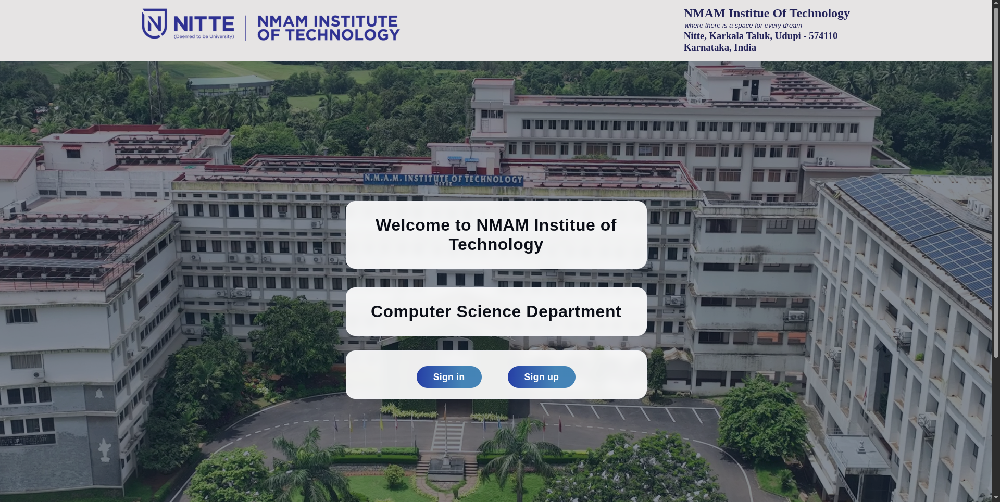
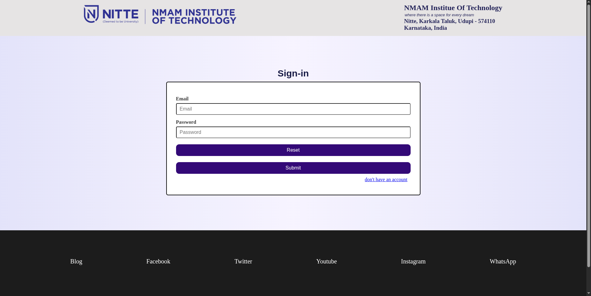

# NMAMIT CSE Direct

A web-based navigation and information portal developed for the Computer Science & Engineering Department of NMAM Institute of Technology. The platform provides quick access to faculty information, classroom locations, laboratory details, and authentication pages through a clean and user-friendly interface. It also includes faculty search functionality and client-side form validation.

## Features

* Department landing page
* Sign In and Sign Up pages
* Faculty directory with search functionality
* Faculty profile information and location details
* Classroom and laboratory information
* Real-time faculty filtering
* Client-side form validation
* Responsive user interface

---

## Tech Stack

### Frontend

* HTML5
* CSS3
* JavaScript

---

## Screenshots

### Landing Page


### Home Page



### Faculty Directory


### Classroom Information


### Authentication



---

## Project Structure

```text
nmamit_cse_direct/
├── css/
│   ├── classroom.css
│   ├── faculty.css
│   ├── home.css
│   ├── main.css
│   ├── sign.css
│   └── style.css
├── html/
│   ├── classroom.html
│   ├── faculty.html
│   ├── home.html
│   ├── sign_in.html
│   └── sign_up.html
├── images/
├── js/
│   ├── faculty_search.js
│   └── form_validation.js
└── index.html
```

---

## Pages

### Landing Page

* Welcome screen for NMAMIT CSE
* Sign In and Sign Up navigation options

### Home Page

* Quick access to faculty details
* Classroom and laboratory information

### Faculty Directory

* Faculty listing with photographs
* Search faculty by name or designation
* Read More option for staff room and location details

### Classroom & Labs

* Classroom locations
* Laboratory details
* Building and floor information

### Authentication

* Sign In form
* Sign Up form
* Email, username, and password validation

---

## Key Functionalities

### Faculty Search

* Search faculty by name
* Search faculty by designation
* Quick faculty selection dropdown
* Smooth scrolling to selected faculty profile

### Form Validation

* Email validation
* Password strength checking
* Username validation
* Form submission verification

---

## Installation

```bash
git clone <repository-url>

cd nmamit_cse_direct
```

Open the project:

```bash
index.html
```

Or use VS Code Live Server.

---

## Author

### Atmika Nayak
