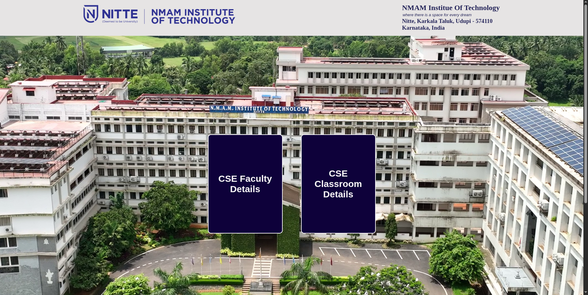
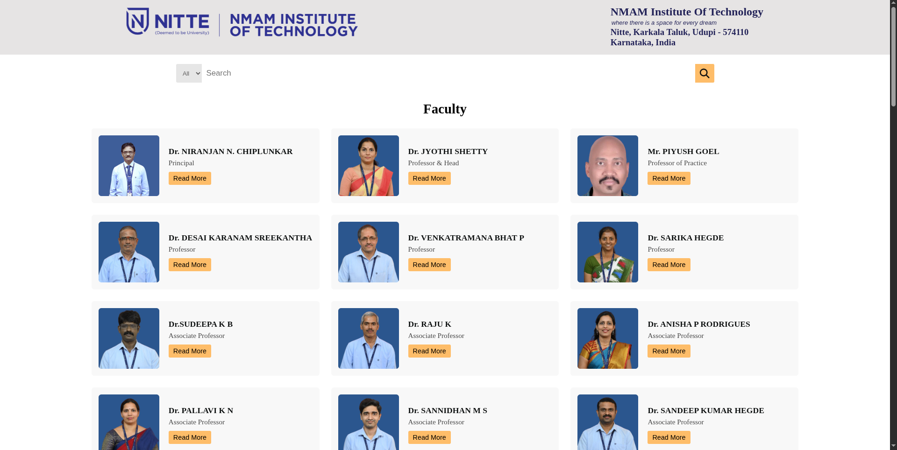
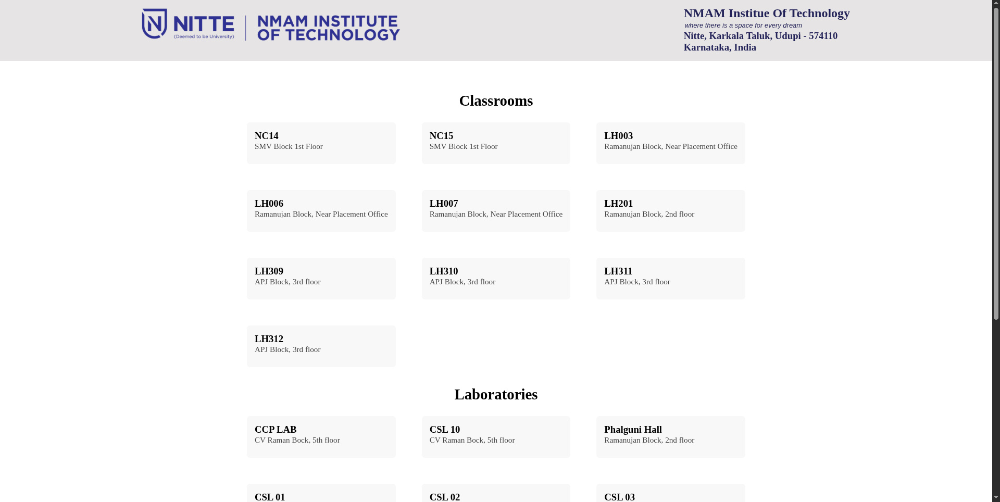

# NMAMIT CSE Direct

A web-based information portal developed for the Computer Science & Engineering Department at NMAM Institute of Technology. The platform helps students access faculty information, classroom details, laboratory locations, and department resources through a simple and organized interface.

## Features

- Faculty directory with search functionality
- Classroom and laboratory information
- Department navigation portal
- Sign In and Sign Up pages
- Form validation using JavaScript
- Responsive interface

## Tech Stack

<p>
  
  
  
</p>

## Project Structure

```text
nmamit_cse_direct/
├── css/
├── html/
├── images/
├── js/
└── index.html
```

## Running Locally

```bash
git clone <repository-url>
cd nmamit_cse_direct
```

Open `index.html` in a browser or run using VS Code Live Server.

## Running Tests

No automated tests are configured for this project.

## Integration Notes

This project can be extended into a complete campus navigation system by integrating backend services, authentication, and database support.

## Visuals

### Landing Page



### Faculty Directory



### Classroom Information



## Additional Resources

- NMAMIT Official Website: https://www.nmamit.in/
